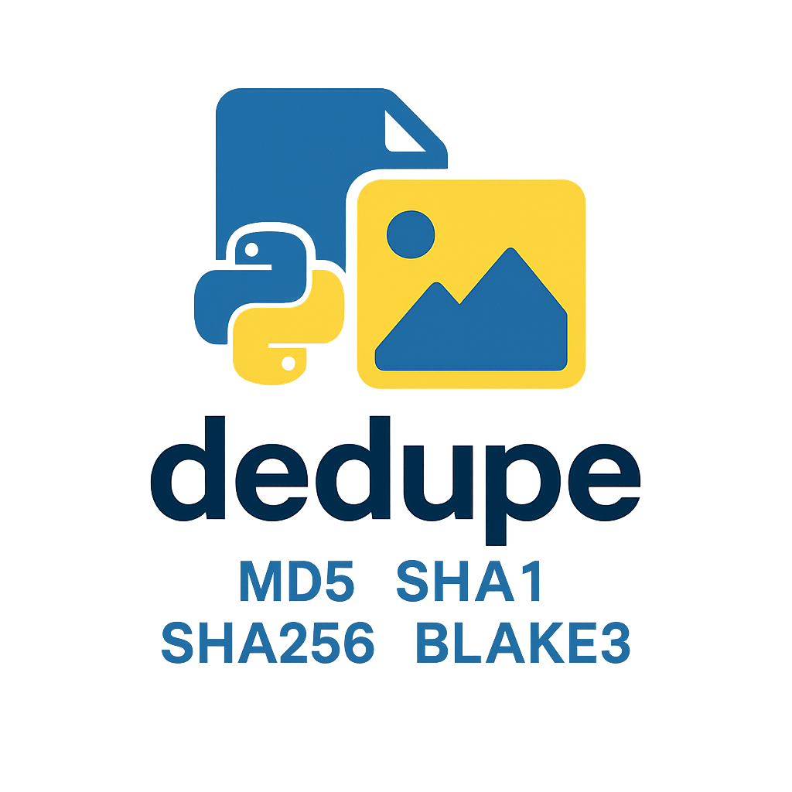

[](https://github.com/isaiah1112/dedupe/actions/workflows/python-tests.yml)

The `dedupe` utility compares files in a directory and identifies duplicates using different hashing algorithms.

## Getting Started
Python 3.10 or newer is required. The Makefile uses `uv` by default and installs it automatically when needed.

### Using make
```commandline
make install
```

This creates or updates the project virtual environment in `.venv`. Activate it with:

```commandline
source .venv/bin/activate
```

To install with pip instead of uv:
```commandline
make install UV_INSTALL=0
```

## Usage

After installation, the `dedupe` command will be available in your environment.

### Find duplicates (default: md5)
```commandline
# Scan a folder and report duplicates (default algorithm: md5)
dedupe ~/Pictures/Wallpapers
```
Possible output:
```
No duplicate files found
```
or
```
Found 1 duplicate file(s)!
Duplicate files moved to: ~/Pictures/Wallpapers/duplicates/
```

### Use a different hash algorithm (sha1, sha256, blake3)
```commandline
# Use SHA-256 for comparisons
dedupe --hash sha256 ~/Videos

# Use BLAKE3 (fast modern hash)
dedupe --hash blake3 ~/Videos
```
Possible output when duplicates exist:
```
Found 2 duplicate file(s)!
Duplicate files moved to: ~/Videos/duplicates/
```

### Remove duplicates instead of moving them
```commandline
# Permanently remove duplicate files
# (use with caution!)
dedupe --remove ~/MyFolder
```
Possible output:
```
Found 1 duplicate file(s)!
Duplicate files removed!
```

### Debug / verbose mode
```commandline
dedupe --debug ~/SomeFolder
```
This enables additional logging for troubleshooting.

## Development

Install the project and its test tools, then run the checks with:

```commandline
make lint
make test
```

To run tests in Docker for a specific Python version:

```commandline
make docker-test PYTHON_VERSION=3.14
```

To run the tests across all supported Python versions:

```commandline
make docker-test-all
```